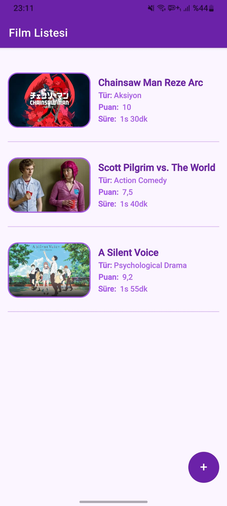
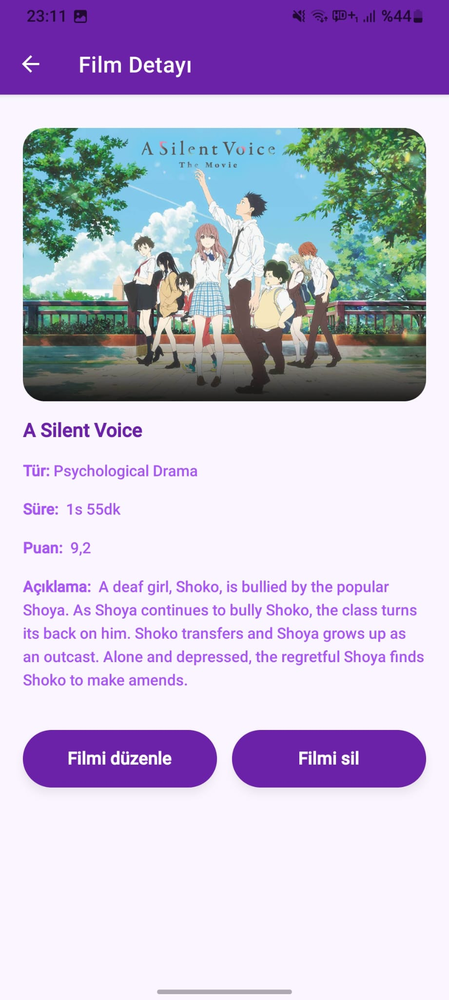
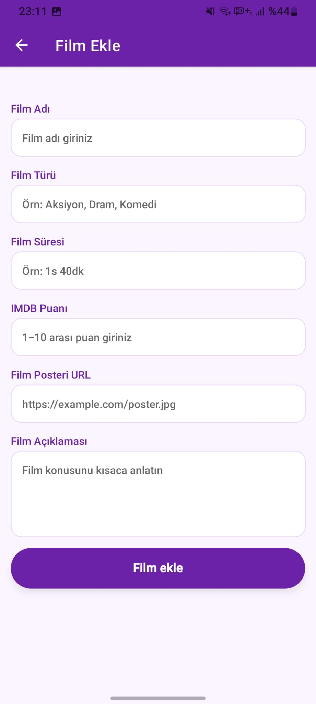
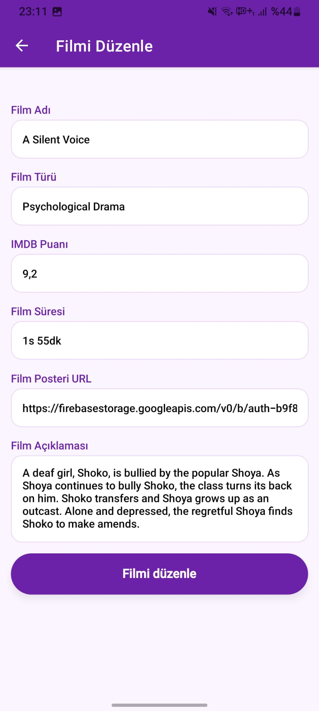

# ReactNative ile Film Listeleme Uygulaması

Bu proje, **ReactNative** , **Firebase**, **React Query**, **TailwindCSS** kullanılarak hazırlanmış 3 sayfalı bir film listeleme uygulamasıdır.


##  Özellikler

- React Query ile veri yönetimi 
- Firebase ile veritabanı  
- Firebase Storage ile film posterleri 
- React Native Router ile sayfa yönetimi 
- TailwindCSS ile kolay özelleştirme  
- Modern ve responsive tasarım  

## 📸 Ekran Görüntüleri
<p>


</p>

<p>


</p>


```

## 🛠 Teknolojiler

- ReactNative
- React Query
- Firebase
- Firebase Storage
- TypeScript
- Tailwind CSS
- ESLint
- Vite

## 🧪 Gereksinimler

- Node.js 18+
- npm (veya yarn)


---
